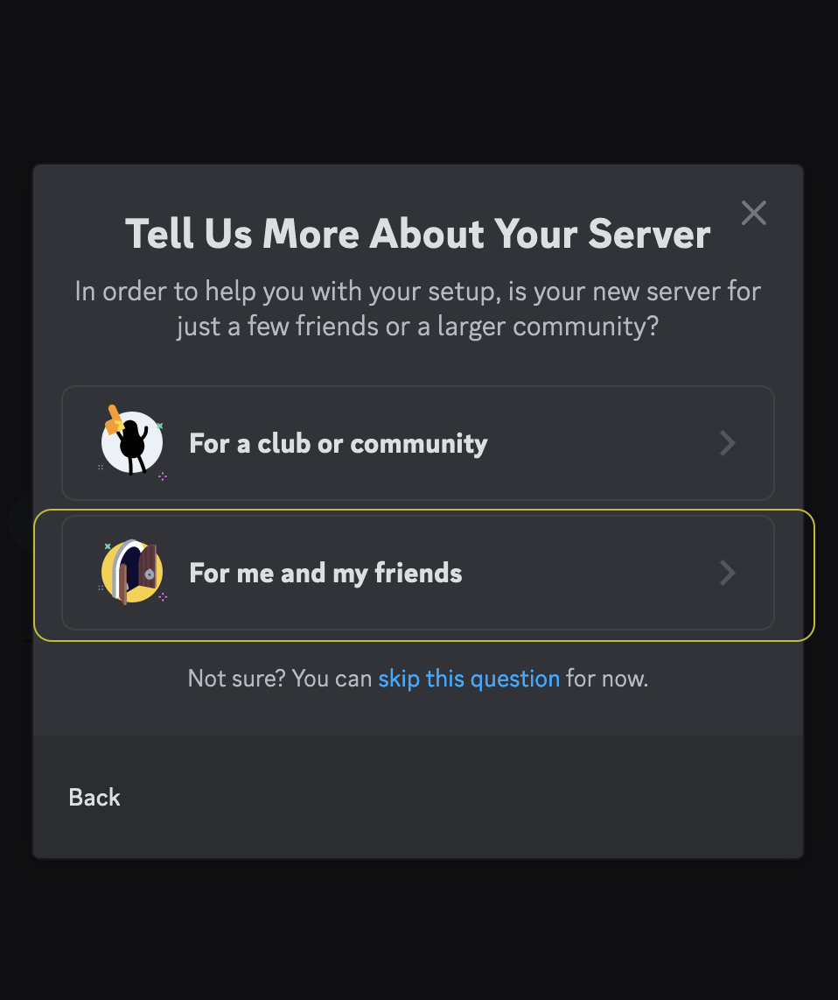
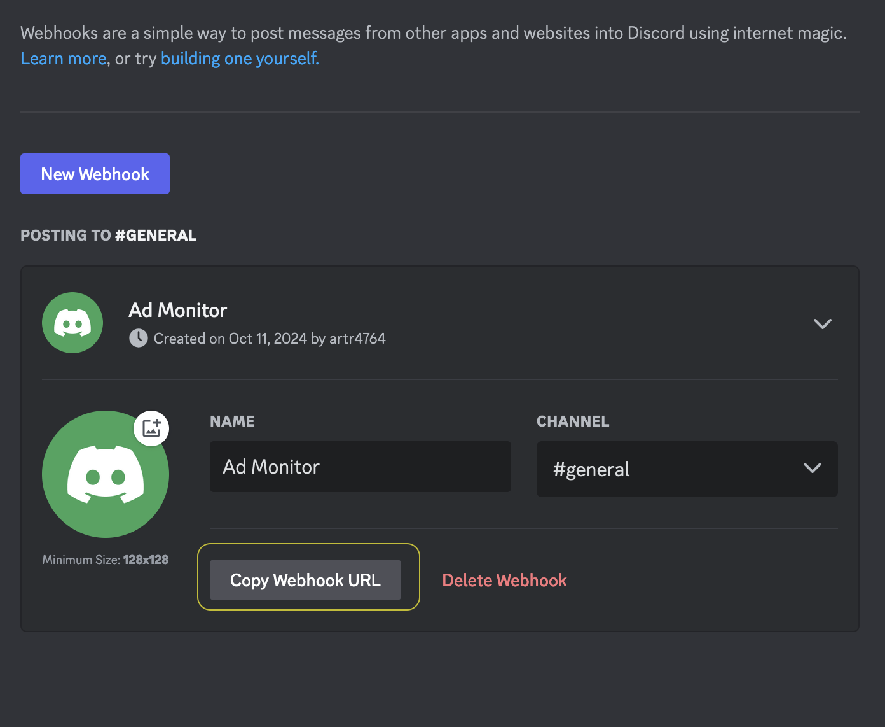
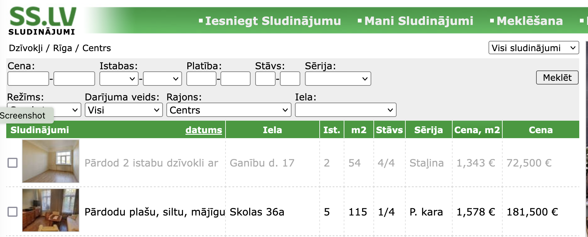
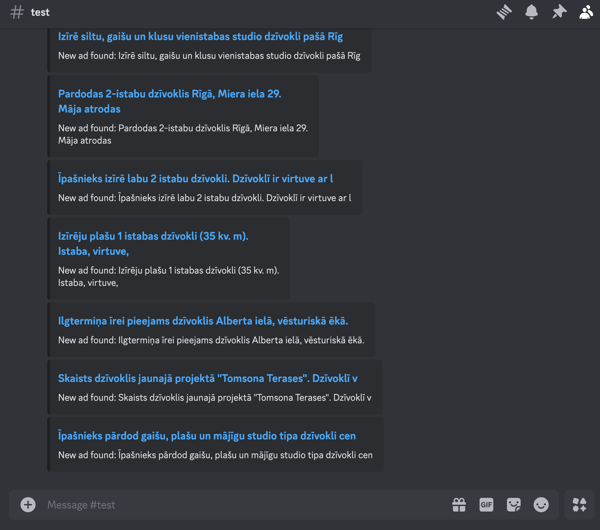

# ss.lv tracker

**ss.lv tracker** ir Python programma, kas seko līdzi lietotāja norādītām ss.lv sludinājumu kategorijām un ziņo par jaunumiem Tavā Discord kanālā. Piemēram, norādot šādus linkus [https://www.ss.lv/lv/real-estate/flats/riga/centre/](https://www.ss.lv/lv/real-estate/flats/riga/centre/) [https://www.ss.lv/lv/transport/cars/alfa-romeo/](https://www.ss.lv/lv/transport/cars/alfa-romeo/), saņemsi Discord paziņojumu par jauniem dzīvokļiem Rīgas centrā un jauniem Alfa Romeo.

## Uzstādīšana
Pārbaudīts, ka strādā uz Ubuntu sistēmas.
```
git clone https://github.com/artbyte32/ss.lv_tracker.git
cd ss.lv_tracker
pip install -r requirements.txt
```

Tālāk vajadzēs uzstādīt jaunu Discord serveri, kurā saņemsi ziņas.

- Ejam uz Discord, spiežam "Add Server" pogu un izveidojam jaunu serveri "For me and my friends", kuram, ja nevienu citu neuzaicināsim, būs piekļuve tikai izveidotājam.
- Spiežam uz teksta kanāla, "Edit Channel".
- "Integrations" -> "Webhooks" -> "New Webhook" -> "Copy Webhook URL"





- Iekopējam Webhook URL `config.json` failā.
- Ejam uz ss.lv, izvēlamies sludinājumu kategorijas un iekopējam linkus `config.json` failā.
- Svarīgi, lai ss.lv links norādītu uz listi ar sludinājumiem, kā redzams attēlā zemāk.



- Startējam programmu `python3 main.py`.
```
Starting advertisement monitor...
Checking for new advertisements on URL: https://www.ss.lv/lv/real-estate/flats/riga/centre/
Skipping a row due to error: 'NoneType' object has no attribute 'get_text'
Found 30 new advertisement(s) on https://www.ss.lv/lv/real-estate/flats/riga/centre/.
Notification sent for 10 ads.
Notification sent for 10 ads.
Notification sent for 10 ads.
```


- Pirmajā reizē pienāks paziņojumi par visiem sludinājumiem pirmajā lapā.
- Atkārtoti palaižot programmu, tiks veikts salīdzinājums ar iepriekš atrasto sludinājumu sarakstu, kas atrodams uzģenerētajā `ads_seen.json`. Vislabāk šo procesu automatizēt, piemēram, ar `cron` uzdevumu.
- Atver `crontab -e` un iekopē `0 * * * * /usr/bin/python3 /path/to/sslv_tracker/main.py`, tikai jānorāda pareizs ceļš uz `main.py`. Tagad programma izpildīsies katru stundu 0. minūtē. Sīkāk - [cron.md](cron.md).

## To-Do
- Tā kā par jauniem tiek uzskatīti sludinājumi, kas nav atrodami `ads_seen.json` un `main.py` to katru reizi ielādē atmiņā + papildina ar jauniem ierakstiem, vajadzētu izveidot mehānismu, kas kaut kad nodzēš vecos ierakstus un vairs par tiem nesūta ziņas.
